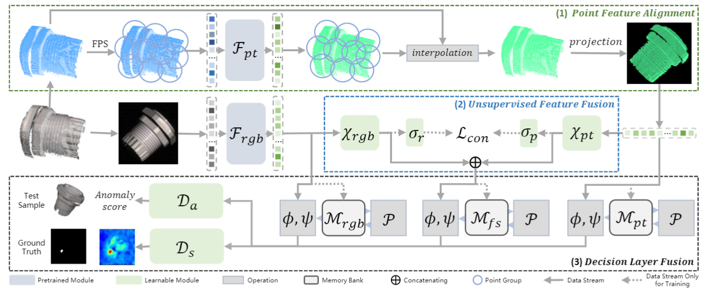

# Multimodal Industrial Anomaly Detection via Hybrid Fusion


- `The pipeline of  Multi-3D-Memory (M3DM).` Our M3DM contains three important parts: (1) **Point Feature Alignment** (PFA) converts Point Group features to plane features with interpolation and project operation, $\text{FPS}$ is the farthest point sampling and $\mathcal{F_{pt}}$ is a pretrained Point Transformer; (2) **Unsupervised Feature Fusion** (UFF) fuses point feature and image feature together with a patch-wise contrastive loss $\mathcal{L_{con}}$, where $\mathcal{F_{rgb}}$ is a Vision Transformer, $\chi_{rgb},\chi_{pt}$ are MLP layers and $\sigma_r, \sigma_p$ are single fully connected layers; (3) **Decision Layer Fusion** (DLF) combines multimodal information with multiple memory banks and makes the final decision with 2 learnable modules $\mathcal D_a, \mathcal{D_s}$ for anomaly detection and segmentation, where $\mathcal{M_{rgb}}$, $\mathcal{M_{fs}}$, $\mathcal{M_{pt}}$ are memory banks, $\phi, \psi$ are score function for single memory bank detection and segmentation, and  $\mathcal{P}$ is the memory bank building algorithm.

[Paper](https://arxiv.org/pdf/2303.00601.pdf)

## Setup

We implement this repo with the following environment:
- Python 3.8
- Pytorch 1.9.0
- CUDA 11.3

Install the other package via:

``` bash
pip install -r requirement.txt
# install knn_cuda
pip install --upgrade https://github.com/unlimblue/KNN_CUDA/releases/download/0.2/KNN_CUDA-0.2-py3-none-any.whl
# install pointnet2_ops_lib
pip install "git+git://github.com/erikwijmans/Pointnet2_PyTorch.git#egg=pointnet2_ops&subdirectory=pointnet2_ops_lib"
```

## Data Download and Preprocess

### Dataset

- The `MVTec-3D AD` dataset can be download from the [Official Website of MVTec-3D AD](https://www.mvtec.com/company/research/datasets/mvtec-3d-ad). 

- The `Eyecandies` dataset can be download from the [Official Website of Eyecandies](https://eyecan-ai.github.io/eyecandies/). 

After download, put the dataset in `dataset` folder.

### Datapreprocess


To run the preprocessing 
```bash
python utils/preprocessing.py datasets/mvtec3d/
```

It may take a few hours to run the preprocessing. 

### Checkpoints

The following table lists the pretrain model used in M3DM:

| Backbone          | Pretrain Method                                                                                                                                                                 |
| ----------------- | ------------------------------------------------------------------------------------------------------------------------------------------------------------------------------- |
| Point Transformer | [Point-MAE](https://drive.google.com/file/d/1-wlRIz0GM8o6BuPTJz4kTt6c_z1Gh6LX/view?usp=sharing)                                                                                       |
| Point Transformer | [Point-Bert](https://cloud.tsinghua.edu.cn/f/202b29805eea45d7be92/?dl=1)                                                                                                        |
| ViT-b/8           | [DINO](https://drive.google.com/file/d/17s6lwfxwG_nf1td6LXunL-LjRaX67iyK/view?usp=sharing)                                                                                   |
| ViT-b/8           | [Supervised ImageNet 1K](https://storage.googleapis.com/vit_models/augreg/B_8-i21k-300ep-lr_0.001-aug_medium1-wd_0.1-do_0.0-sd_0.0--imagenet2012-steps_20k-lr_0.01-res_224.npz) |
| ViT-b/8           | [Supervised ImageNet 21K](https://storage.googleapis.com/vit_models/augreg/B_8-i21k-300ep-lr_0.001-aug_medium1-wd_0.1-do_0.0-sd_0.0.npz)                                        |
| ViT-s/8           | [DINO](https://dl.fbaipublicfiles.com/dino/dino_deitsmall8_pretrain/dino_deitsmall8_pretrain.pth)                                                                               |
| UFF                | [UFF Module](https://drive.google.com/file/d/1Z2AkfPqenJEv-IdWhVdRcvVQAsJC4DxW/view?usp=sharing)                                                                               |

Put the checkpoint files in `checkpoints` folder.

## Train and Test

Train and test the double lib version and save the feature for UFF training:

```bash
mkdir -p datasets/patch_lib
python3 main.py \
--method_name DINO+Point_MAE \
--memory_bank multiple \
--rgb_backbone_name vit_base_patch8_224_dino \
--xyz_backbone_name Point_MAE \
--save_feature \
```

Train the UFF:

```bash
OMP_NUM_THREADS=1 python3 -m torch.distributed.launch --nproc_per_node=1 fusion_pretrain.py    \
--accum_iter 16 \
--lr 0.003 \
--batch_size 16 \
--data_path datasets/patch_lib \
--output_dir checkpoints \
```

Train and test the full setting with the following command:

```bash
python3 main.py \
--method_name DINO+Point_MAE+Fusion \
--use_uff \
--memory_bank multiple \
--rgb_backbone_name vit_base_patch8_224_dino \
--xyz_backbone_name Point_MAE \
--fusion_module_path checkpoints/{FUSION_CHECKPOINT}.pth \
```

Note: if you set `--method_name DINO` or `--method_name Point_MAE`, set `--memory_bank single` at the same time. 


If you find this repository useful for your research, please use the following.

```bibtex
@inproceedings{wang2023multimodal,
  title={Multimodal Industrial Anomaly Detection via Hybrid Fusion},
  author={Wang, Yue and Peng, Jinlong and Zhang, Jiangning and Yi, Ran and Wang, Yabiao and Wang, Chengjie},
  booktitle={Proceedings of the IEEE/CVF Conference on Computer Vision and Pattern Recognition},
  pages={8032--8041},
  year={2023}
}
```

## Thanks

Our repo is built on [3D-ADS](https://github.com/eliahuhorwitz/3D-ADS) and [MoCo-v3](https://github.com/facebookresearch/moco-v3), thanks their extraordinary works!
